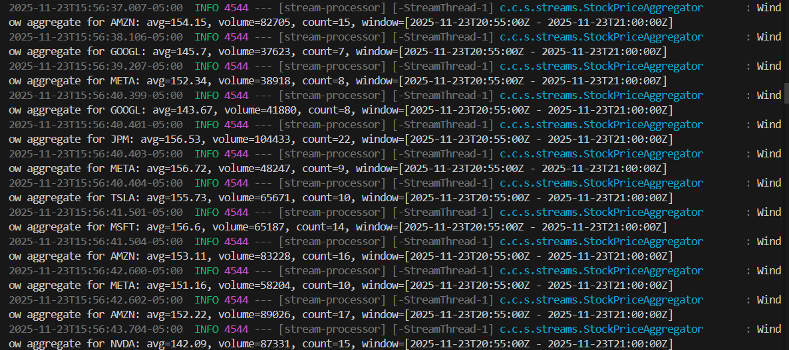
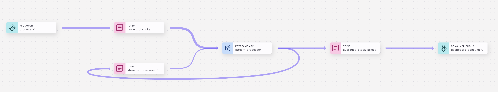

# Spring Stock Analysis

A multi-module Spring Boot 3 project for real-time stock analysis using Apache Kafka. This project demonstrates a complete streaming data pipeline from data generation through processing to real-time visualization.

## Architecture

The project consists of three independent Spring Boot applications:

```
┌─────────────────────┐      ┌──────────────────────┐      ┌─────────────────────┐
│  Market Simulator   │─────▶│  Stream Processor    │─────▶│ Dashboard Backend   │
│   (Producer)        │      │  (Kafka Streams)     │      │   (Consumer)        │
└─────────────────────┘      └──────────────────────┘      └─────────────────────┘
         │                              │                              │
         │                              │                              │
         ▼                              ▼                              ▼
  raw-stock-ticks              averaged-stock-prices            WebSocket Clients
     (Topic)                         (Topic)
```

## Prerequisites

  - Java 17 or higher
  - Apache Maven 3.6+
  - A Confluent Cloud account (or a local Kafka cluster with SASL/SSL configured)

-----

## Setup Guide

This project is configured to run securely with Confluent Cloud. Follow these steps to set up your environment.

### 1\. Confluent Cloud Setup

1.  **Log in** to your Confluent Cloud account.
2.  **Create a Cluster** if you don't have one.
3.  **Get Cluster Settings:**
      * Go to **Cluster Settings**.
      * Copy the **Bootstrap server** URL (e.g., `pkc-xxxxx.region.provider.confluent.cloud:9092`).
4.  **Create API Credentials:**
      * Go to **API Keys**.
      * Create a new key based on your required granularity (Global access is easiest for development).
      * **Copy the Key and Secret immediately**. You won't be able to see the secret again.

### 2\. Create Kafka Topics

In your Confluent Cloud cluster, create the following two topics with default settings (e.g., 3 partitions):

  * `raw-stock-ticks`
  * `averaged-stock-prices`

### 3\. Configure Environment Secrets

**IMPORTANT:** Do not commit your secrets to version control. This project uses `.env` files to load sensitive credentials into environment variables.

You must create a file named `.env` inside **each of the three module directories**:

  * `market-simulator/.env`
  * `stream-processor/.env`
  * `dashboard-backend/.env`

Add the following content to **each** of the three `.env` files, replacing the placeholders with your actual Confluent Cloud values:

```env
KAFKA_BOOTSTRAP_SERVERS=your-bootstrap-server-url:9092
KAFKA_API_KEY=YOUR_ACTUAL_API_KEY
KAFKA_API_SECRET=YOUR_ACTUAL_API_SECRET
```

-----

## Building the Project

From the root directory of the project, build all modules:

```bash
mvn clean install
```

-----

## Running the Complete Pipeline

You will need **three separate terminal windows** to run the pipeline.

**Critical Note:** In each terminal, you must load the variables from the `.env` file into the session *before* running the application. The commands below show how to do this.

### Terminal 1: Stream Processor (The Brain)

Start this first so it's ready to process data.

```bash
cd stream-processor

# Load secrets from the .env file into this terminal session
set -a
source .env
set +a

# Run the application
mvn spring-boot:run
```
### Stream Processor Expected Output:


*Wait until you see logs indicating the state has transitioned to `RUNNING`.*

### Terminal 2: Dashboard Backend (The Consumer)

Start this next to listen for processed results.

```bash
cd dashboard-backend

# Load secrets from the .env file into this terminal session
set -a
source .env
set +a

# Run the application
mvn spring-boot:run
```
### Dashboard Backend Expected Output:


*The application will start on port 8082.*

### Terminal 3: Market Simulator (The Producer)

Start this last to begin generating data.

```bash
cd market-simulator

# Load secrets from the .env file into this terminal session
set -a
source .env
set +a

# Run the application
mvn spring-boot:run
```

*You will see logs showing stock ticks being sent every second.*

-----

## Connecting to the Dashboard

Once all three applications are running, you can connect to the WebSocket endpoint to receive real-time updates.

  * **WebSocket Endpoint:** `http://localhost:8082/ws`
  * **Subscription Topic:** `/topic/stock-prices`

**Example Client-Side Code:**

```javascript
const socket = new SockJS('http://localhost:8082/ws');
const stompClient = Stomp.over(socket);
stompClient.connect({}, function() {
    console.log('Connected to WebSocket');
    stompClient.subscribe('/topic/stock-prices', function(message) {
        const stockData = JSON.parse(message.body);
        console.log('Received Stock Update:', stockData);
    });
});
```

## Data Models

### StockTick (Raw Data Input)

```json
{
  "symbol": "AAPL",
  "price": 178.45,
  "volume": 5420,
  "timestamp": "2024-01-15T10:30:00Z"
}
```

### AveragedStockPrice (Processed Data Output)

```json
{
  "symbol": "AAPL",
  "averagePrice": 178.23,
  "totalVolume": 162540,
  "count": 30,
  "windowStart": "2024-01-15T10:30:00Z",
  "windowEnd": "2024-01-15T10:35:00Z"
}
```

## Technology Stack

  - **Spring Boot 3.2.0**
  - **Spring Cloud Stream Kafka Streams**
  - **Apache Kafka 3.6.0**
  - **WebSocket (STOMP/SockJS)**
  - **Lombok**
  - **Jackson**


## Stream Lineage:


## License

This project is provided as-is for educational and demonstration purposes.
